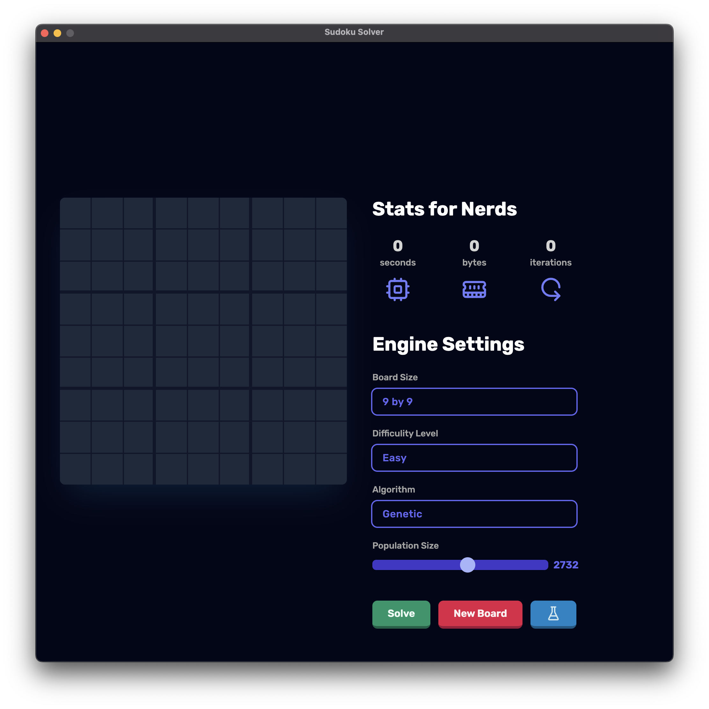

# Sudoku Solver App

Welcome to our Sudoku Solver app README! This application is developed as part of an AI course project aimed at solving Sudoku puzzles of different sizes, including 9x9, 6x6, and 4x4. The solver engine is implemented in Python, utilizing backtracking and genetic algorithms. The client-side interface is built using Electron JS.

## Features

- **Sudoku Board Sizes:** Our app supports solving Sudoku puzzles of various sizes: 9x9, 6x6, and 4x4.
- **Solving Algorithms:** The solver utilizes two main algorithms: backtracking and genetic algorithms.
- **Insights:** Users can gain insights into the solving process, including solving time, memory usage, and iterations taken for each algorithm.
- **Testing:** We provide a testing feature where users can evaluate the solver's performance by running it against a dataset containing 500 random Sudoku boards with their solutions, sourced from a larger collection of 10,000 puzzles stored in a CSV format.

## Installation

To install the Sudoku Solver app, follow these steps:

1. Clone the repository to your local machine.
2. Navigate to the client directory `cd sudoku/client`.
3. Install dependencies by running `npm i`.
4. Start the application with `npm start`.

## Usage

1. Launch the application.
2. Select the size of the Sudoku board you want to solve (9x9, 6x6, or 4x4).
3. Input the initial numbers into the grid or click "New Board" to generate a random board.
4. Choose the solving algorithm (backtracking or genetic).
5. Click the "Solve" button to initiate the solving process.
6. View insights such as solving time, memory usage, and iterations taken.
7. Optionally, run the testing feature to evaluate the solver's performance.

## Screenshots

## Contributors

- [Amir Moahmed](https://github.com/amirintech)
- [Sameh](https://github.com/Sambonic)
- [Amr Magdy](https://github.com/)
